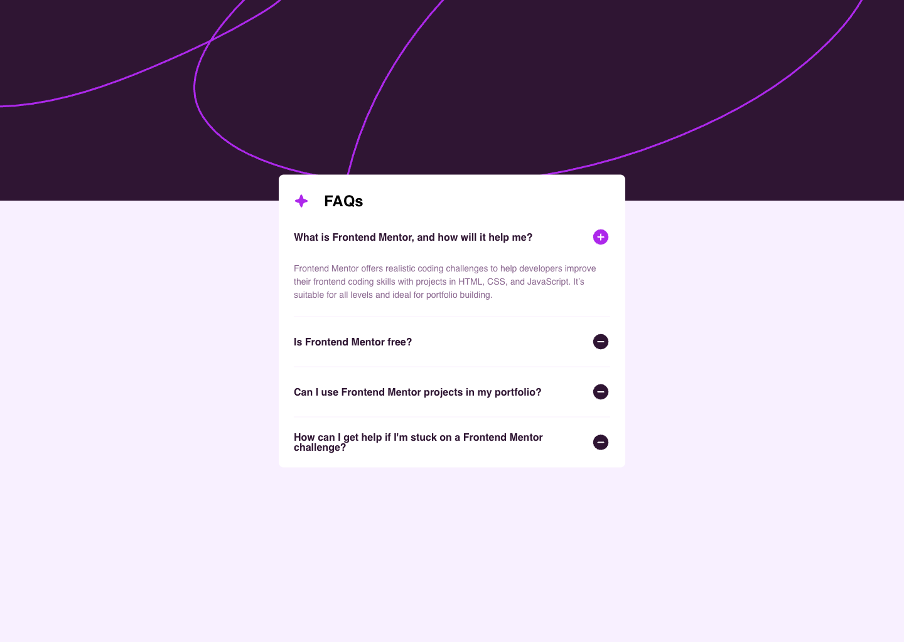

# FAQ accordion solution

## Table of contents

- [Overview](#overview)
    - [Screenshot](#screenshot)
    - [Links](#links)
- [My process](#my-process)
    - [Built with](#built-with)
    - [What I learned](#what-i-learned)

## Overview

### Screenshot



### Links

- Live Site URL: [Add live site URL here](https://your-live-site-url.com)

## My process

### Built with

- Semantic HTML5 markup
- CSS custom properties
- Flexbox
- CSS Grid
- Mobile-first workflow
- [React](https://reactjs.org/) - JS library
- Motion

### What I learned
- To animate an element while unmounting, we need to use <AnimatePresence> in motion
```jsx
<AnimatePresence>
  {
    selectedFaq === faq.question &&
    <motion.p
      className="app__faq-list-answer"
      initial="collapsed"
      animate="open"
      exit="collapsed"
      variants={{
        open: { opacity: 1, height: "auto" },
        collapsed: { opacity: 0, height: 0 }
      }}
      transition={{ duration: 0.4 }}
    >{faq.answer}</motion.p>
  }
</AnimatePresence>
```
